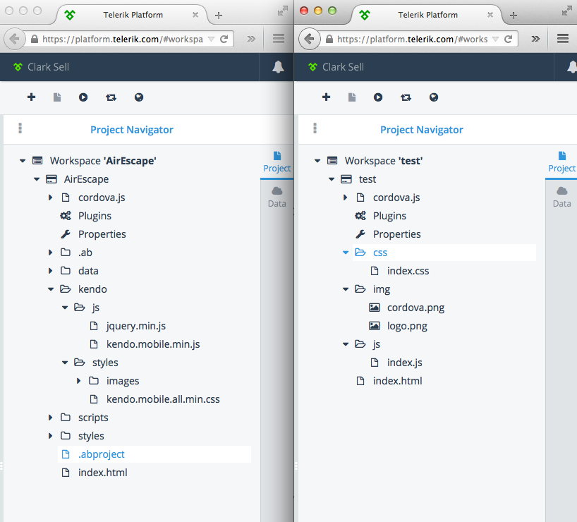
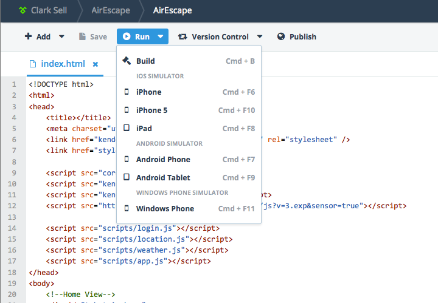
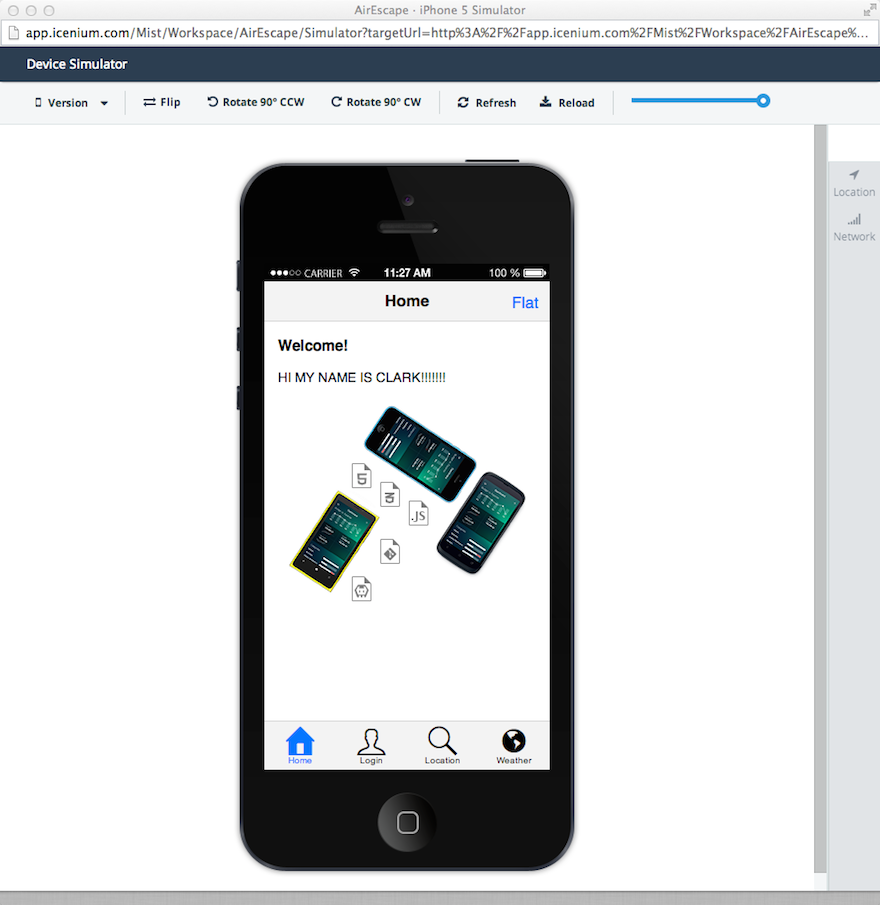

Week 1 is officially over at [Telerik](http://telerik.com) and as expected, I survived. To get up to speed with everyone going on, I decided to just drop myself on my head and build something on the [Telerik Platform](http://Platform.Telerik.com). Let's be clear here. I'm going to ship a real deal and to each app store. Not some demo thing, where we can afford the ability to hide off in weird corners when things might get ugly.

So, whatcha building then Clark? Well a year ago, I bought this kick ass whole house air fan made by [AirScape](http://www.airscapefans.com/products/Shop/Natural-Cooling/Whole-House-Fans/AirScape-4.4e-WHF). Now you might be looking at that saying, "yea that is a little overkill chief". Maybe, but there are two reasons I bought it:

* Quiet. I mean, really quiet. No really, you have no clue just how quiet this thing really is.
* It has a web server. Yes let me repeat, it has a web server. This puppy pushes air and angle brackets. FACT: before I even purchased it, the angle brackets were calling my name. 

With all that I have going on right now, it seemed like a good time to finally take this little idea I've had and make it a reality. Now over the past year, I actually already wrote an neat little app for the Windows Phone. 

Simple I know, but I\we use it all the time and its provided a great deal of value. In doing this, it's also really helped how I think about the overall usage pattern and scenarios we find ourselves using it. I've made many changes to support a few different ideas, but the harsh reality, I just never bothered to ship it. Honestly, I've been too hung up on the iOS and Android deployments and I really didn't want to maintain a number of different code bases. After all I have a day job (new one mind you), family, oh and run [That Conference](http://thatconference.com). Needless to say, I have too many things going on.

At Telerik, we have a product called [AppBuilder](http://www.telerik.com/appbuilder). I first started using it years ago, when it was in beta and called [Icenium](http://www.telerik.com/appbuilder). In fact, it's what we use to create the apps for [That Conference](http://thatconference.com). Now truth be told it's been a long time since I've used it. To make it more interesting, today I now work primarily on OSX.

Now enough of this meta level stuff, let's get started already. Now my goal isn't to go through in detail how to do each little thing, as I will just reference the excellent documentation at Telerik for that. I would rather walk through everything else. Things like my pitfalls, design ideas, extension points, and even how it will perform out in the market when we ship it. My point it to capture the other stuff, and capture it from OSX.

# Personas

Let's start with the personas. Who exactly is the user of this? At the onset this would seem simple, the homeowners, but is that really the case? Are there others? Now I have two kids and over the last year they in fact might pick up the phone, to turn *off* the fan. They also use the wall switch which has no ties to any mobile app.

All in all, I think it's fair to say the primary user will be the homeowner but the secondary will be the rest of the people in the family, which might include children. 

Now there is a third persona is the the house itself but more on that another day.

# Features

The features for this first release will be keep to just the basics. Lets look at what we're going to build over the next couple of weeks:

* Turn on and off the fan.
* Set the timer on the fan.
* Step up the fan speed.
* Step down the fan speed.
* Show some indicator of relative fan speed.
* Progress indicator while calling the fan.
* Support in iOS, Android, Windows Phone.
* Manage: Address of the fan.
* Display: Version of the payload.
* Ability to give: Feedback to me.

# Beyond Functional

Now those features get us operational with the fan, but I think we can take it a step further and add some unique value to our mobile device and better yet our overall experience with it. 

I would like to take it a step further and add something like the following:

* Push notifications as to when the fan speed has changed. There are wall switches and it would be notified if the fan was kicked on by accident when say maybe the windows are closed.
* Geofencing. When you leave the house, be notified if the fan is in fact still on. This might sounds like a weird feature but this fan sucks some MAJOR air through the house and is VERY quite. So if you're in a hurry and run out of the house closing all of the windows you might forget to turn the fan off.
* NFC support. I often will go to bed and just set the fan to speed 2 and set the timer for 2 hours. To do this I have to open the app, blaa, blaa. Why not just tap an NFC sticker next to the bed and have it set it automatically. You could imagine this changes the way we might interact with the fan and the app itself. I might have an NFC sticker in the garage that would do the opposite and just shut everything off on my way out to the car.
* Some kind of trial versions, yes I am going to charge for this as some beer money would be nice.

# AppBuilder

To achieve all of this, we're going to build a hybrid mobile app  using [Telerik's AppBuilder](http://www.telerik.com/appbuilder).   Getting started in AppBuilder is pretty dead simple:

* Head over to [platform.telerik.com](http://platform.telerik.com)
* Create an account and log in.
* Create a new workspace (collection of projects).
* Create a project and start coding.

Now there are a few different projects (5 in fact) we can create, specifically: 

* A high fidelity prototyping tool called: [AppPrototyper](http://www.telerik.com/appprototyper) which is in preview.
* The code project itself: [AppBuilder](http://www.telerik.com/appbuilder).
* Application analytics project called: [Analytics](http://www.telerik.com/analytics)
* Backend services for things like push notification called: [Backend Services](http://www.telerik.com/backend-services)
* Testing project called: [Mobile Testing](http://www.telerik.com/mobile-testing)

Right now my setup is pretty bare bones basic of each of those. As the time goes one we will use each of them in some detail.

# Hello World

From here let's start with creating our code project and making sure the base template just runs out of the box.

I'm starting from the Kendo UI Mobile project template. Basically this is the blank template with the addition of the Kendo UI already added. You can see the projects side by side here as there really isn't much different:

With out base template, let's just run it in the simulator.

Which will bring up a simulator in a new browser window. 

If you leave that simulator up and running, you will see when code changes are made in AppBuilder and saved, that the simulator will refresh automatically. Similar to how something like
[LiveReload](http://livereload.com/) works.

Along the way, I accidentally managed to discover the keyboard shortcuts. I forgot I was in an browser, hit *Command + S*, and things saved as expected. We're all pretty used to those shortcuts from our favorite IDE and needless to say, very nice touch.

Also make sure to check out [Creating a New Project](http://docs.telerik.com/platform/appbuilder/creating-your-project/creating-a-new-project#create-a-new-project-in-the-appbuilder-command-line-interface) for more in depth detail.

# Setting up the CLI

Now wait a minute, I don't want to code in the browser. That's cool let me introduce you to the CLI. The strategy here is the same between Windows and OSX but there are currently a few gaps in the OSX world. To step out of the browser, we need to make sure we have a few things already setup.

1. OSX Mavericks (or Windows if your on a Windows machine) 
2. [node.js](http://nodejs.org/) and 0.10.22 or higher.
3. [Sublime Text](http://www.sublimetext.com/3). In this case I am using the beta of v3.

With the base requirements meet, we can then add the AppBuilder CLI and the Sublime Text package. Important, before we can install the package for Sublime we have to setup the CLI. There is an NPM package for that conveniently called *appbuilder*.

	npm install appbuilder -g

Now for me, this is where #FAILWHALE started. My package started to install and then just puked due to security rights. Again this is my first week and I've got a machine which wasn't a fresh install, so I have been trying to get things right. I managed to get some error such as:

	npm ERR! Please try running this command again as root/Administrator.

After some looking into a few things, It appeared I had a few  weird permissions issues, so I ran two different commands: 

	sudo chown -R `whoami` ~/.npm
	sudo chown -R $USER /usr/local

Reran the npm install and it sailed right through.

You can find the official system requirements for the [AppBuilder CLI here.](http://docs.telerik.com/platform/appbuilder/running-appbuilder/running-the-cli/system-requirements-cli)

# Next up, setting up Sublime

If your running [Sublime Text](http://www.sublimetext.com/) the first thing we need to do (if you haven't already) is setup the package manager. This is simple, check out [Installing Sublime Package Manager](https://sublime.wbond.net/installation)

Now that we have the package manager in place we just need to install our AppBuilder Package. You can find the package here: [https://sublime.wbond.net/packages/Telerik%20AppBuilder](https://sublime.wbond.net/packages/Telerik%20AppBuilder) as Telerik AppBuilder. It will also appear in the Package Control Menu as you should expect.

# Linking Version Control

Now that we've got a few of these pieces setup we really need to get our source control setup. This is really our link between both [platform.telerik.com](http://platform.telerik.com) and just doing development locally. Regardless, it's just a good idea right? 

For me, I created a new project on GitHub. Then just integrated it with my AppBuilder project, and cloned it locally.  See all the details about how to [integrate version control](http://docs.telerik.com/platform/appbuilder/version-control/integrated-version-control).

# Build and Running 

With our repo cloned, I opened my my folder in Sublime and hit *Tools -> Telerik AppBuilder -> Build and Deploy*.

Now when I did this, I got:

	There are no projects in your currently opened folders
	Deploy failed

So I turned to our newly installed CLI and ran:

	appbuilder build ios --compainion

But received managed to receive this:

	No project found at or above '/Users/Sell/source/github/AirEscapeAppCopy/AirEscape' and neither was a --path specified.

note: We could run the android or Windows Phone version as well *appbuilder build android --compainion, appbuilder build wp8 --compainion*

I honestly had absolutely no clue what was going on here. Why was this not working, after all we say things work in the browser already. Furthermore, I could see my project file right there, so what was in fact wrong? Well as it turns out part of my problem was the fact I was missing another project file called the *.abproject*.

To create this, let's turn back to the CLI. Dig down in our project directory and run the following:

	$ appbuilder init

This will create a new hidden file, again called *.abproject* from the directory of which you ran the command. This is a JSON file that has a number of build setting contained in it. These setting look to be later used when we create our packages for the respective app stores.

quick sidebar...
You might be hiding your hidden files and not see the *.abproject* file. If you would like to show all files in the finder then run the following from the terminal:  

	defaults write com.apple.finder AppleShowAllFiles YES
	relaunch your finder.

With our *.abproject* file created we can run again from the terminal and everything will build as expected. Having said that Sublime Text still doesn't work as it want's to be connected to a device. This is something I will dig into when we get further down the road and I know is a bit different between OSX and Windows.

**Running** 

Unlike on Windows, there isn't yet a simulator or a way to run our project on the machine, but we can run it on a device. To do this we need to install and run what is called the companion app. This app will be the container that will host our app until we later publish it.

[AppBuilder for the iOS](https://itunes.apple.com/bg/app/telerik-appbuilder/id527547398?mt=8)

Before when we ran *appbuilder build ios --compainion* what we we're doing was having the cloud build a package that we can install in the companion app. This is why you saw the browser open with the QR Code after the build was completed. 

To install our app, open the companion app, and use three fingers to swipe right on the screen. Here you will see a menu, *My Project*, *QR Scanner*, and *Help*. Select the *QR Scanner* and scan that QR code the CLI popped. This will install that build of your app. Now we can play away, but our app isn't anything yet. Once installed you can just hold three fingers down on the screen and it will refresh itself with the latest build.

Now we're running locally, AND in the cloud which is pretty cool. Now we just need to build something.

# Next Steps

Well that turned out to be much more than anticipated. Regardless, I wanted to set some overall context while introducing you to a few things and highlight a few of the potholes I managed to run into on OSX. Next up we will start to implement the UI and get some JavaScript running talking to our fan.

# Quick References

* [AppBuilder Documentation](http://docs.telerik.com/platform/appbuilder/introduction/index)
* [AppBuilder NPM Package](https://www.npmjs.org/package/appbuilder)
* [AppBuilder Sublime Package](https://github.com/Icenium/appbuilder-sublime-package#usage)
* [iTunes AppBuilder App](https://itunes.apple.com/bg/app/telerik-appbuilder/id527547398?mt=8)
* [Sublime Text]([Sublime Text](http://www.sublimetext.com/))
* [Installing Sublime Package Manager](https://sublime.wbond.net/installation)
* [The Telerik Platform—Now With 100% More Sublime Text](http://blogs.telerik.com/blogs/14-04-03/the-telerik-platform-now-with-100-more-sublime-text)

~ Clark