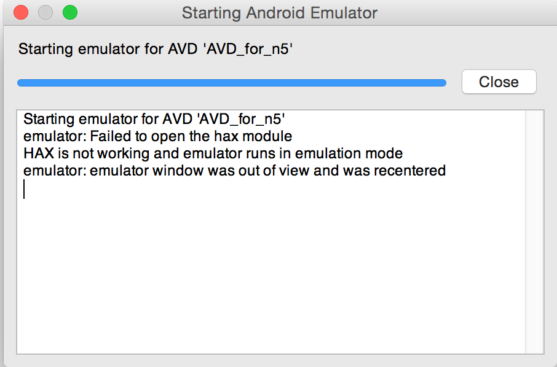
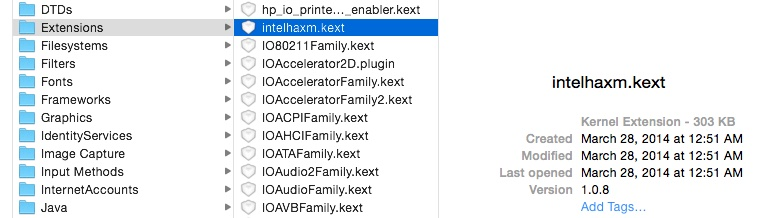
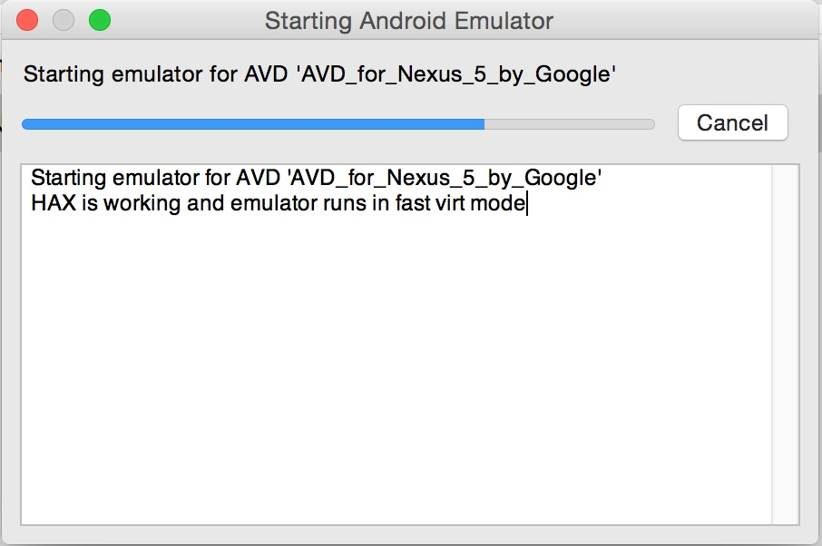

Let’s start with, this shouldn’t have been complicated, frustrating, or even taken anywhere near the amount of time that  it managed too. Well it did and here is the story.

I’ve started messing around with the Android stack. My main machine is a MacBook running OS X but like most OS X geeks out there, I took the plunge with Yosemite when it came out. Now this machine is relatively new for me, so that means I haven’t had long to really make it my own adding the different development tools and any other crazy configuration things that I will one day forget. So I figure it’s about time to destroy it with beta software right? With 10.10 installed what could go wrong? Honestly it’s been smooth.

Since we’re installing beta software, why not get started with Android development using more beta? Introducing [Android Studio beta](https://developer.android.com/sdk/installing/studio.html). The install was smooth and everything appeared to work as expected.

Now it was time for the real fun, run hello world. I fired up the emulator. It ran, but running was really more like walking, or really crawling. After talking with a few colleagues it was clear that I needed to install this little thing called HAXM or use Genymotion. 

[HAXM](https://software.intel.com/en-us/android/articles/intel-hardware-accelerated-execution-manager) or Intel’s Hardware Accelerated Execution Manager, manages the hardware-assisted virtualization engine (hypervisor) that uses Intel Virtualization Technology (Intel® VT), or simply a kernel extension which makes things faster, much faster. While not required, it’s the bit of juice you want installed when working Android emulators. This is true of both, Windows and OS X, although I am just talking about OS X, and OX X 10.10 today. 

Alright well don’t tell me twice, I downloaded the DMG and ran that installer.  Click, click, next, next, done. Always read the [installation instructions first right](https://software.intel.com/en-us/android/articles/installation-instructions-for-intel-hardware-accelerated-execution-manager-mac-os-x)? Fired back up the AVD Manager, started my emulator and saw:

Uhh, HAX not working? What do you mean? I just installed it, or did I? Like you would, I went back and reinstalled but this time I paid attention to the dialogs. Following along, the installer/configurator said my machine supported it but the very last dialog titled: **VT/NX not enabled** *While your machine supports it, your hardware is in a state which has disabled it.*  I paraphrase.

So let’s see if it’s really supported. From the terminal let’s run:

	sysctl -a | grep machdep.cpu.features 

This will output the following which details what features your CPU supports. The key for us will be seeing **VMX**, which is Intel’s virtualization stack.

	machdep.cpu.features: FPU VME DE PSE TSC MSR PAE MCE CX8 APIC SEP MTRR PGE MCA CMOV PAT PSE36 CLFSH DS ACPI MMX FXSR SSE SSE2 SS HTT TM PBE SSE3 PCLMULQDQ DTES64 MON DSCPL VMX SMX EST TM2 SSSE3 CX16 TPR PDCM SSE4.1 SSE4.2 x2APIC POPCNT AES PCID XSAVE OSXSAVE TSCTMR AVX1.0 RDRAND F16C

Well my CPU supports virtualization, WTF. Good news the HAXM installer at least matched my machine configuration, more importantly what is it about my hardware that is disabling the VMX stack?

Now I grew up on Windows so my first thought was, well there must be a BIOS setting which has the VMX stack is disabled. False. On OS X and really the Apple hardware, there is no such thing as a BIOS and if the machine supports VMX then it’s on by default, regardless. Next.

In looking at the [HAXM installation instructions](https://software.intel.com/en-us/android/articles/installation-instructions-for-intel-hardware-accelerated-execution-manager-mac-os-x), there are a few different commands to pay attention too, specifically ktext*. Let’s see if HAXM is running:  

	kextstat | grep intel

Well that returned nothing, but had me asking, what is kext? Well kext is short for kernel extension, or the system drivers if your from the Windows world. Let’s just run kextstat.

	github  kextstat
	Index Refs Address            Size       Wired      Name (Version) <Linked Against>
    1  104 0xffffff7f80a30000 0x8c50     0x8c50     com.apple.kpi.bsd (14.0.0)
    2    7 0xffffff7f80e3f000 0x28c0     0x28c0     com.apple.kpi.dsep (14.0.0)
    3  125 0xffffff7f80a03000 0x20500    0x20500    com.apple.kpi.iokit (14.0.0)
    4  135 0xffffff7f80a24000 0xbf50     0xbf50     com.apple.kpi.libkern (14.0.0)
    5  119 0xffffff7f80a00000 0x2d50     0x2d50     com.apple.kpi.mach (14.0.0)
	….

This is the running list (a snip of mine) of extension. So if it’s not running, then do we have it? Let’s look. You can find extensions here **./System/Library/Extensions** as each are represented as a kext file.

 

We have it and it’s not running, let’s get it started.

	sudo kextload -bundle-id com.intel.kext.intelhaxm 

That didn’t work, so let’s Bing it on Google. After doing a bit of searching I found a few gold nuggets.

* [Using Intel Haxm technology on Mac OSX 10.10 Yosemite](http://www.reddit.com/r/androiddev/comments/2bujz2/using_intel_haxm_technology_on_mac_osx_1010/)
* [HAXM OS X Yosemite support?](https://software.intel.com/en-us/forums/topic/516400)
* [Apple OS X v10.10 Release Notes](https://developer.apple.com/library/prerelease/mac/releasenotes/General/rn-osx-10.10/index.html)

**Bingo!**

> In Developer Preview 7, unsigned or improperly signed kexts will not be loaded. To use unsigned kexts during development, this strict check can be disabled by adding a “kext-dev-mode=1” boot arg.

Let it rain the beta software collision. In short, 10.10 isn’t loading unsigned or improperly signed kexts (good thing) and Intel’s HAXM isn’t signed for 10.10. At this point, we have three options:

1. Deal with the crappy performance of the emulator. Not really an option.
2. Bypass the kext validation by adding the boot-args, scary.
3. Use [Genymotion](https://cloud.genymotion.com) which is another tool for running emulators.

Let’s look into #2, I like to live scared. But before we go adding boot-args to our machine, let just take a look what the current state actually is:

	nvram -p

Now [nvram](https://developer.apple.com/library/mac/documentation/Darwin/Reference/Manpages/man8/nvram.8.html) is our command and it simply manipulates the firmware’s NVRAM variables. The **-p** switch will print all the variables while **-d** would delete a variable. As we’ve seen, we have what looks to be a key/value pair of settings.

At this point you should feel a bit funny about disabling the security check on kexts, and you should. You’re responsible for your own machine, it’s security and it’s overall health. In our case it looks like we’ve just been bitten by the beta adoption bug and we’re caught between the release of 10.10 which should be around the corner AND when Intel releases the updated version of HAXM. With that being the case, let’s jump in two feet and bypass that kext check.

> **Proceed With Caution**. Grown men have cried messing up boot configurations.

	sudo nvram boot-args="kext-dev-mode=1"

With the variable added, let’s reboot the machine, reinstall just to see how the installer behaves. I think I could have just loaded the kext but I decided to restart and reinstall.

This time, things installed as expected and when I fired up my emulator, success…

Yes, this was a long answer to what amounted to a single command but I thought it was important to understand how I got here and why. It’s even more important to underscore that once 10.10 ships AND we get the right HAXM package we should back out our change if in fact final version didn’t already do that for us.

`Clark